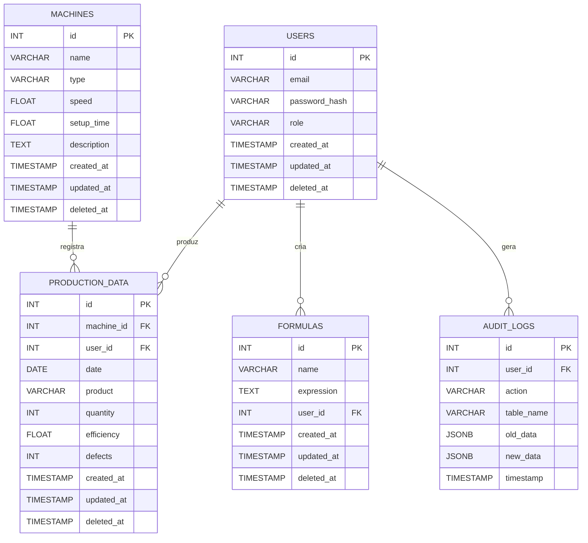

# Scripts SQL - AnalisadorProducaoWeb

Esta pasta contém os scripts de inicialização, estrutura e dados de exemplo do banco de dados PostgreSQL do projeto.

## Arquivos
- **init.sql**: Criação do banco e usuário padrão.
- **schema.sql**: Estrutura das tabelas principais (usuários, máquinas, produção, fórmulas, logs).
- **seed.sql**: Dados de exemplo para testes iniciais.

## Como usar
1. Execute `init.sql` para criar o banco e o usuário (apenas uma vez).
2. Execute `schema.sql` para criar as tabelas.
3. (Opcional) Execute `seed.sql` para popular o banco com dados de exemplo.

Exemplo usando psql:
```bash
psql -U postgres -f init.sql
psql -U analisador_user -d analisador_producao -f schema.sql
psql -U analisador_user -d analisador_producao -f seed.sql
```

## Estrutura das Tabelas

### users
- `id`: Identificador único (PK)
- `email`: E-mail do usuário (único, obrigatório)
- `password_hash`: Hash da senha
- `role`: Papel do usuário (`admin`, `manager`, `viewer`)
- `created_at`, `updated_at`, `deleted_at`: Auditoria/soft delete

### machines
- `id`: Identificador único (PK)
- `name`: Nome único da máquina
- `type`: Tipo da máquina
- `speed`: Velocidade padrão (>0)
- `setup_time`: Tempo de setup (>=0)
- `description`: Descrição opcional
- `created_at`, `updated_at`, `deleted_at`: Auditoria/soft delete

### production_data
- `id`: Identificador único (PK)
- `machine_id`: Máquina relacionada (FK para `machines`)
- `user_id`: Usuário responsável (FK para `users`)
- `date`: Data da produção
- `product`: Produto
- `quantity`: Quantidade produzida
- `efficiency`: Eficiência (%)
- `defects`: Defeitos
- `created_at`, `updated_at`, `deleted_at`: Auditoria/soft delete

### formulas
- `id`: Identificador único (PK)
- `name`: Nome da fórmula
- `expression`: Expressão matemática
- `user_id`: Usuário criador (FK para `users`)
- `created_at`, `updated_at`, `deleted_at`: Auditoria/soft delete

### audit_logs
- `id`: Identificador único (PK)
- `user_id`: Usuário responsável (FK para `users`)
- `action`: Ação realizada
- `table_name`: Tabela afetada
- `old_data`: Dados antigos (JSON)
- `new_data`: Dados novos (JSON)
- `timestamp`: Data/hora do log

## Relacionamentos
- Um usuário pode criar várias fórmulas, registros de produção e logs.
- Uma máquina pode ter vários registros de produção.
- Os logs de auditoria registram ações de usuários em qualquer tabela.

## Diagrama ER
Veja abaixo o diagrama ER simplificado do banco:



## Boas práticas
- Sempre versionar scripts de alteração de schema.
- Não coloque dados sensíveis em seed.sql.
- Mantenha este README atualizado ao criar novas tabelas ou scripts. 