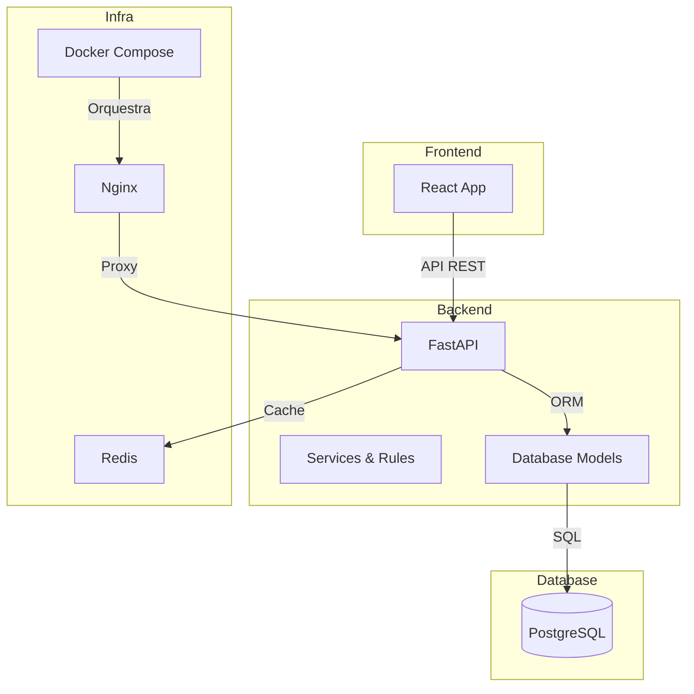

# Arquitetura do Sistema

O sistema PlataformaPCP é composto por:
- **Frontend:** React 18 + TypeScript + Tailwind CSS
- **Backend:** FastAPI + Python + SQLAlchemy
- **Banco de Dados:** PostgreSQL
- **Infraestrutura:** Docker Compose, Nginx, Redis

## Diagrama de Arquitetura

## Componentes Principais
- **Frontend:** Interface de administração e dashboards.
- **Backend:** API REST, lógica de negócio, regras de máquinas.
- **Database:** Armazena máquinas, parâmetros, produção, usuários.
- **Infra:** Orquestração, proxy reverso, cache.

---

*Para detalhes de fluxos, veja [fluxos.md](fluxos.md)* 