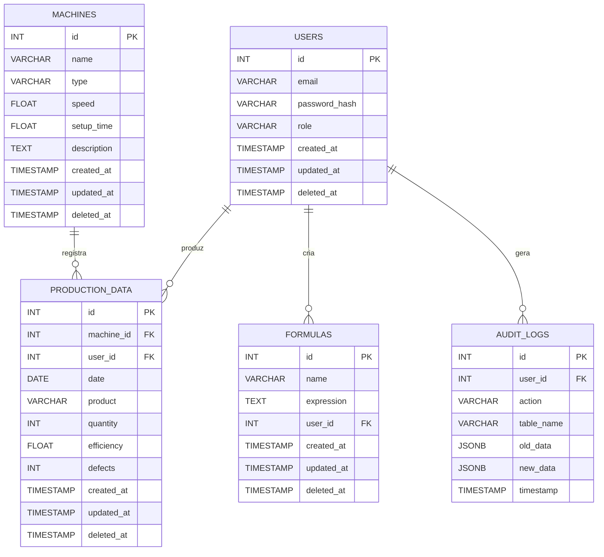

# 📚 Documentação do Banco de Dados - AnalisadorProducaoWeb

Esta documentação detalha a modelagem, estrutura, exemplos de uso e boas práticas do banco de dados PostgreSQL do projeto.

---

## 📊 Diagrama ER



---

## 🗂️ Estrutura das Tabelas

### users
- `id`: Identificador único (PK)
- `email`: E-mail do usuário (único, obrigatório)
- `password_hash`: Hash da senha
- `role`: Papel do usuário (`admin`, `manager`, `viewer`)
- `created_at`, `updated_at`, `deleted_at`: Auditoria/soft delete

### machines
- `id`: Identificador único (PK)
- `name`: Nome único da máquina
- `type`: Tipo da máquina
- `speed`: Velocidade padrão (>0)
- `setup_time`: Tempo de setup (>=0)
- `description`: Descrição opcional
- `created_at`, `updated_at`, `deleted_at`: Auditoria/soft delete

### production_data
- `id`: Identificador único (PK)
- `machine_id`: Máquina relacionada (FK para `machines`)
- `user_id`: Usuário responsável (FK para `users`)
- `date`: Data da produção
- `product`: Produto
- `quantity`: Quantidade produzida
- `efficiency`: Eficiência (%)
- `defects`: Defeitos
- `created_at`, `updated_at`, `deleted_at`: Auditoria/soft delete

### formulas
- `id`: Identificador único (PK)
- `name`: Nome da fórmula
- `expression`: Expressão matemática
- `user_id`: Usuário criador (FK para `users`)
- `created_at`, `updated_at`, `deleted_at`: Auditoria/soft delete

### audit_logs
- `id`: Identificador único (PK)
- `user_id`: Usuário responsável (FK para `users`)
- `action`: Ação realizada
- `table_name`: Tabela afetada
- `old_data`: Dados antigos (JSON)
- `new_data`: Dados novos (JSON)
- `timestamp`: Data/hora do log

---

## 🔎 Exemplos de Queries Comuns

### 1. Velocidade média de uma máquina em uma OP específica
```sql
SELECT AVG(efficiency) AS media_velocidade
FROM production_data
WHERE machine_id = 2 AND product = 'OP12345' AND date >= CURRENT_DATE - INTERVAL '1 year';
```

### 2. Histórico de produção de uma faca específica
```sql
SELECT * FROM production_data
WHERE product = 'Faca 011'
ORDER BY date DESC;
```

### 3. Produção total por máquina em um período
```sql
SELECT m.name, SUM(p.quantity) AS total_produzido
FROM machines m
JOIN production_data p ON m.id = p.machine_id
WHERE p.date BETWEEN '2024-01-01' AND '2024-12-31'
GROUP BY m.name;
```

### 4. Logs de auditoria de um usuário
```sql
SELECT * FROM audit_logs
WHERE user_id = 1
ORDER BY timestamp DESC;
```

---

## 🚀 Dicas de Performance
- Crie índices para colunas usadas em filtros e joins frequentes (ex: `machine_id`, `date`, `user_id`).
- Use `EXPLAIN` para analisar queries pesadas.
- Prefira tipos de dados adequados (ex: `INTEGER` para contagem, `FLOAT` para médias).
- Use `VACUUM` periodicamente para manter o banco otimizado.

---

## 💾 Backup e Restore
- **Backup:**
  ```bash
  pg_dump -U postgres -d analisador_producao -F c -b -v -f backup_analisador.dump
  ```
- **Restore:**
  ```bash
  pg_restore -U postgres -d analisador_producao -v backup_analisador.dump
  ```
- Mantenha backups automáticos e teste restores periodicamente.

---

## 📋 Convenções e Boas Práticas
- Use sempre `snake_case` para nomes de tabelas e colunas.
- Documente cada alteração de schema e mantenha scripts versionados.
- Prefira chaves estrangeiras e constraints para garantir integridade.
- Não armazene dados sensíveis em texto puro.
- Atualize esta documentação a cada evolução do banco. 