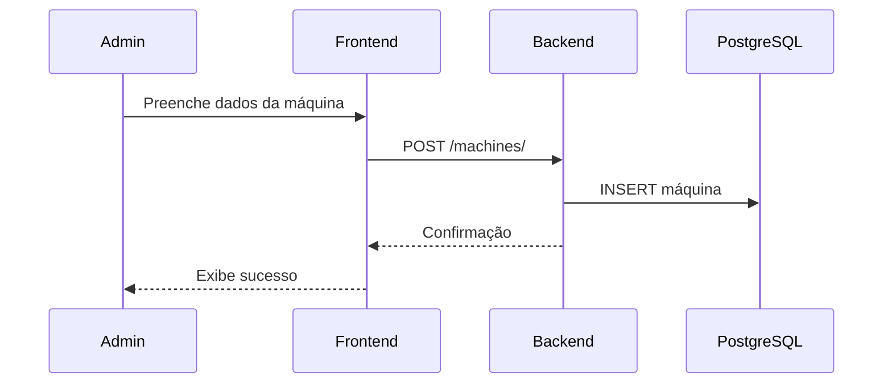
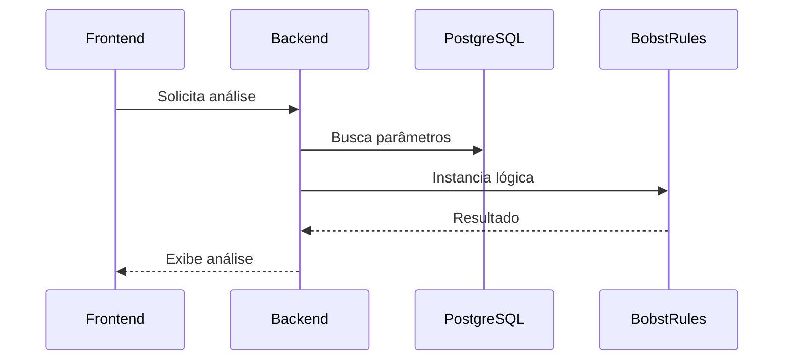

# Fluxos de Dados e Processos

## Fluxo de Cadastro de Máquina

1. Usuário (admin) acessa o frontend e preenche o formulário de cadastro de máquina.
2. Frontend envia requisição POST para `/machines/` no backend.
3. Backend valida e salva os dados no banco (PostgreSQL).
4. Máquina fica disponível para uso nas análises e dashboards.

## Fluxo de Análise de Produção

1. Sistema busca parâmetros da máquina no banco.
2. Instancia a lógica da máquina (ex: Bobst) via registry.
3. Realiza cálculos de produção conforme regras.
4. Retorna resultados para o frontend.

---

*Para detalhes de endpoints, veja [api/endpoints.md](api/endpoints.md)* 