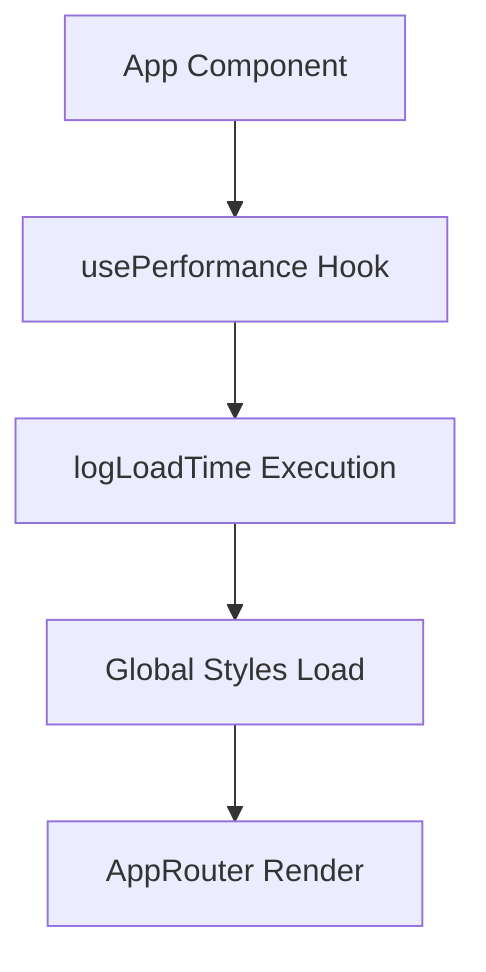
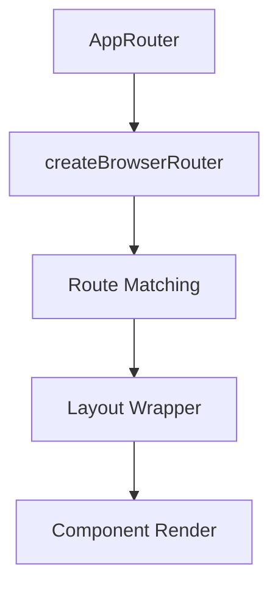
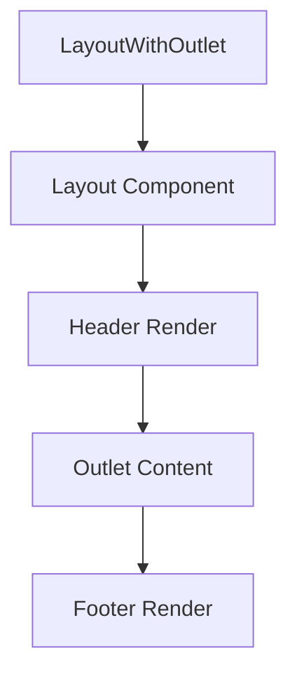

# Módulo App - Documentação Técnica

## Visão Geral
O módulo `app` é o núcleo da aplicação, responsável pela configuração principal, roteamento e inicialização dos sistemas globais da plataforma de Gestão Industrial Inteligente.

## Estrutura do Módulo

```
src/app/
├── App.tsx              # Componente raiz da aplicação
├── index.ts             # Barrel exports do módulo
└── router.tsx           # Configuração do sistema de rotas
```

## Componentes Principais

### 1. App Component

**Localização:** `src/app/App.tsx`

**Responsabilidade:**
- Inicialização da aplicação
- Carregamento de estilos globais
- Performance monitoring
- Renderização do router principal

```typescript
const App: React.FC = () => {
  const { logLoadTime } = usePerformance()

  useEffect(() => {
    logLoadTime('PlataformaPCP')
  }, [logLoadTime])

  return <AppRouter />
}
```

**Características Técnicas:**
- **Performance Tracking:** Monitoramento de tempo de carregamento
- **Global Styles:** Importação de CSS global e animações
- **Single Responsibility:** Foco apenas na inicialização
- **Clean Architecture:** Delegação do roteamento para componente específico

**Dependências:**
```typescript
// Core Utils
import { usePerformance } from '@/core/utils/performance'

// Router
import { AppRouter } from './router'

// Global Styles
import '@/shared/styles/globals.css'
import '@/shared/styles/animations.css'
```

### 2. AppRouter Component

**Localização:** `src/app/router.tsx`

**Responsabilidade:**
- Configuração de todas as rotas da aplicação
- Layout wrapper com sistema de outlet
- Tratamento de rotas não encontradas (404)
- Estrutura para módulos futuros

```typescript
const router = createBrowserRouter([
  {
    path: '/',
    element: <LayoutWithOutlet />,
    children: [
      { index: true, element: <HomePage /> },
      // Module routes...
    ],
  },
  { path: '*', element: <div>404 - Página não encontrada</div> },
]);
```

**Características Técnicas:**
- **Nested Routing:** Utiliza React Router v6 com outlets
- **Layout Wrapper:** Aplicação consistente do layout em todas as páginas
- **Future-Ready:** Estrutura preparada para novos módulos
- **Error Handling:** Tratamento de rotas inválidas

## Arquitetura de Roteamento

### Estrutura Hierárquica

```
/                           # Root route com Layout
├── / (index)              # HomePage (home module)
├── /modules/
│   ├── /production-analyzer    # Módulo de Análise de Produção
│   ├── /maintenance           # Módulo de Manutenção  
│   ├── /inventory             # Módulo de Estoque
│   ├── /quality               # Módulo de Qualidade
│   ├── /integrations          # Módulo de Integrações
│   └── /analytics             # Módulo de Analytics
└── /* (404)               # Página não encontrada
```

### Layout Strategy

**LayoutWithOutlet Component:**
```typescript
const LayoutWithOutlet: React.FC = () => {
  return (
    <Layout>
      <Outlet />
    </Layout>
  );
};
```

**Vantagens:**
- **Consistência:** Layout aplicado automaticamente em todas as rotas
- **Performance:** Layout não re-renderiza durante navegação
- **Flexibilidade:** Outlet permite conteúdo dinâmico por página

## Configurações e Integrações

### Performance Monitoring

**Implementação:**
```typescript
const { logLoadTime } = usePerformance()

useEffect(() => {
  logLoadTime('PlataformaPCP')
}, [logLoadTime])
```

**Funcionalidades:**
- **Load Time Tracking:** Medição de tempo de inicialização
- **Performance Metrics:** Coleta de métricas para otimização
- **User Experience:** Monitoramento de performance percebida

### Global Styles Import Order

```typescript
import '@/shared/styles/globals.css'      // Base styles e reset
import '@/shared/styles/animations.css'   // Animações reutilizáveis
```

**Importância da Ordem:**
1. **globals.css:** CSS reset, variáveis, estilos base
2. **animations.css:** Keyframes e classes de animação
3. **Component Styles:** CSS Modules específicos (importados nos componentes)

## Padrões Implementados

### 1. **Single Responsibility Principle**
- `App.tsx`: Apenas inicialização e setup
- `router.tsx`: Apenas configuração de rotas
- `index.ts`: Apenas exports

### 2. **Separation of Concerns**
```typescript
// App.tsx - Application Bootstrap
const App: React.FC = () => {
  // Performance setup
  // Global styles
  // Router initialization
}

// router.tsx - Route Configuration  
const router = createBrowserRouter([
  // Route definitions
  // Layout configuration
  // Error boundaries
])
```

### 3. **Future-Proof Architecture**
```typescript
// Estrutura preparada para expansão
{
  path: '/modules/production-analyzer',
  element: <div>Production Analyzer Module</div>, // Placeholder
  // Future: element: <ProductionAnalyzerPage />
}
```

## Fluxo de Inicialização

### 1. **Application Bootstrap**


### 2. **Router Initialization**


### 3. **Layout Application**


## Error Handling e Fallbacks

### 404 Error Handling
```typescript
{
  path: '*',
  element: <div>404 - Página não encontrada</div>,
}
```

**Melhorias Futuras:**
```typescript
// Implementação completa de 404
{
  path: '*',
  element: <NotFoundPage />,
  errorElement: <ErrorBoundary />
}
```

### Error Boundaries (Recomendado)
```typescript
// Future implementation
const router = createBrowserRouter([
  {
    path: '/',
    element: <LayoutWithOutlet />,
    errorElement: <RootErrorBoundary />,
    children: [
      // routes with individual error boundaries
    ]
  }
]);
```

## Testing Strategy

### Unit Tests
```typescript
// App.tsx tests
describe('App Component', () => {
  it('should initialize performance monitoring')
  it('should load global styles correctly')
  it('should render AppRouter')
  it('should call logLoadTime on mount')
})

// router.tsx tests  
describe('AppRouter', () => {
  it('should render HomePage on root route')
  it('should apply Layout to all routes')
  it('should handle 404 for invalid routes')
  it('should navigate between modules correctly')
})
```

### Integration Tests
```typescript
describe('App Integration', () => {
  it('should navigate from home to modules')
  it('should maintain layout across navigation')
  it('should handle browser back/forward')
  it('should preserve scroll position')
})
```

## Performance Considerations

### 1. **Code Splitting Preparation**
```typescript
// Future lazy loading implementation
const HomePage = lazy(() => import('@/modules/home/pages/HomePage'));
const ProductionAnalyzer = lazy(() => import('@/modules/production-analyzer'));

// With Suspense boundaries
{
  path: '/modules/production-analyzer',
  element: (
    <Suspense fallback={<ModuleLoader />}>
      <ProductionAnalyzer />
    </Suspense>
  )
}
```

### 2. **Bundle Optimization**
- **Tree Shaking:** Imports específicos dos módulos
- **CSS Splitting:** Separação de estilos por módulo
- **Asset Optimization:** Lazy loading de recursos pesados

### 3. **Runtime Performance**
- **Router Optimization:** Minimal re-renders durante navegação
- **Layout Persistence:** Layout não re-monta entre rotas
- **Memory Management:** Cleanup de subscriptions e listeners

## Roadmap de Desenvolvimento

### Fase Atual ✅
- [x] Estrutura básica do App
- [x] Sistema de roteamento funcional
- [x] Layout wrapper implementado
- [x] Performance monitoring básico

### Próxima Fase 🔄
- [ ] Error boundaries completos
- [ ] Loading states entre rotas
- [ ] Breadcrumb navigation
- [ ] Route guards para autenticação

### Fase Avançada 🔮
- [ ] Code splitting automático
- [ ] Preload de módulos críticos
- [ ] PWA configuration
- [ ] Advanced analytics tracking

## Convenções e Boas Práticas

### Route Naming
```typescript
// Padrão: /modules/{module-name}
'/modules/production-analyzer'  ✅
'/modules/maintenance'          ✅
'/production-analyzer'          ❌
'/modules/productionAnalyzer'   ❌
```

### Component Organization
```typescript
// App level components
const App              // Application root
const AppRouter        // Route configuration
const LayoutWithOutlet // Layout wrapper

// Clear separation of concerns
```

### Import Organization
```typescript
// External dependencies
import React from 'react'
import { createBrowserRouter } from 'react-router-dom'

// Internal core
import { usePerformance } from '@/core/utils/performance'

// Internal shared
import { Layout } from '@/shared/components/layout'

// Internal modules
import { HomePage } from '@/modules/home/pages/HomePage'

// Styles (last)
import '@/shared/styles/globals.css'
```

## Conclusão

O módulo `app` estabelece uma fundação sólida para a aplicação com:

- **Arquitetura Limpa:** Separação clara de responsabilidades
- **Escalabilidade:** Estrutura preparada para crescimento
- **Performance:** Monitoramento e otimizações built-in
- **Manutenibilidade:** Código organizado e bem documentado

Esta estrutura permite que a aplicação cresça de forma organizada, mantendo consistência e qualidade conforme novos módulos são adicionados.